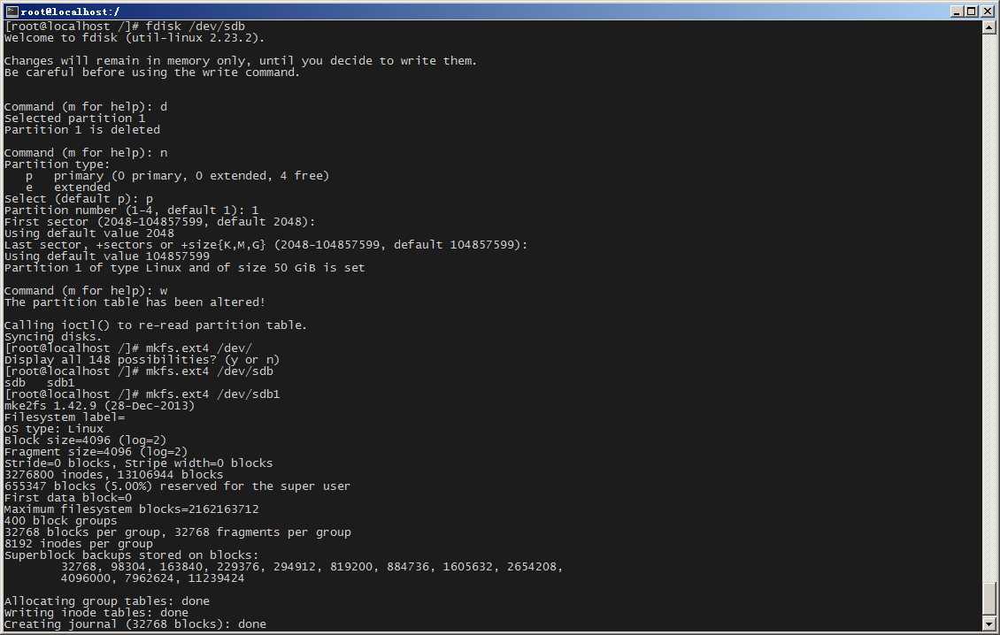
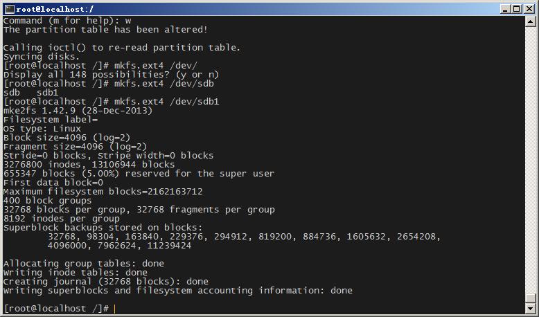

### Linux添加硬盘

1. 检测新增存储
```
# fdisk -l /dev/sdb
```
1. 创建新分区
```
# fdisk /dev/sdb
```

1. 格式化分区
```
# msf.ext4 /dev/sdb1
```

1. 挂载新硬盘
```
# mount /dev/sdb1 /patent
```
1. 设置开机自动挂载
```
# vi /etc/fstab
>>> /dev/sdb1 /patent  ext4  auto    defaults  0 0
```
